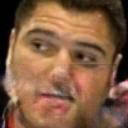
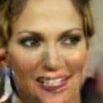

# What's this?
Is it possible to generate mouth image only from the information how eyes look like?  
Eyes2mouth network answers this question using Deep Learning and pix2pix network.  
Here, we show our scheme.  

# Samples

  

  

  

# How to use
## Train
1. Download celeba dataset
    ~~~bash
    $ ./download_celeba/sh
    ~~~
2. Cropping faces
    ~~~bash
    $ python gen_dataset.py
    ~~~
3. Start training
    ~~~bash
    $ python main.py --phase train --dataset_name cropped_128 --batch_size 10 --fine_size 128 --lr 0.00002
    ~~~

## Test
1. Start testing
    ~~~bash
    $ python main.py --phase test --dataset_name cropped_128 --batch_size 10 --fine_size 128
    ~~~
