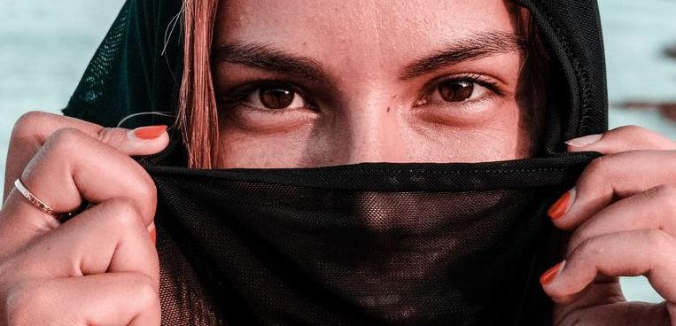
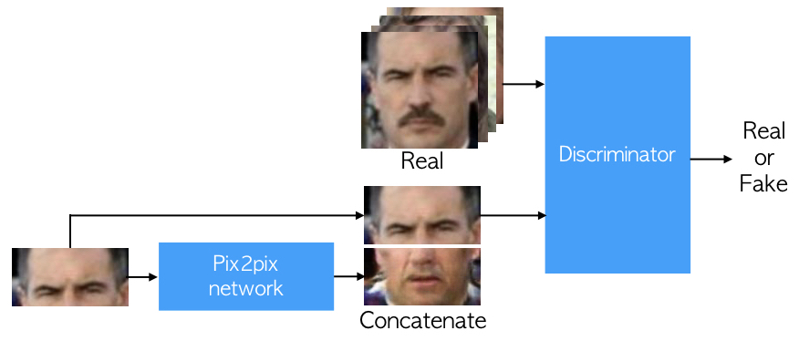

# eyes2mouth network
Is it possible to generate mouth image only from the information how eyes look like?  
Eyes2mouth network answers this question using Deep Learning and pix2pix network.

# What's this?
First, we separate face images into a mouth image and eyes image.
We use Celeba dataset (http://mmlab.ie.cuhk.edu.hk/projects/CelebA.html) as training face images.  
A eye image is feed into pix2pix network (https://github.com/phillipi/pix2pix) and generated image is concatenated the eye image we used as input.  
The pix2pix network learns to generate realistic mouth images so that the concatenated images are classified as real by a discriminator.  
When training is success, the pix2pix network ends up with generating a realistic mouth image which fits with the input eyes image.

# Samples

  

  

  

